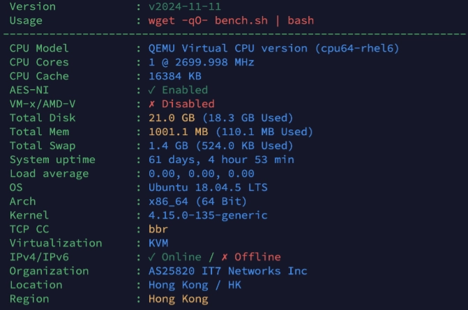
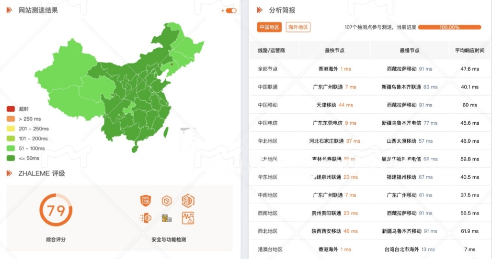
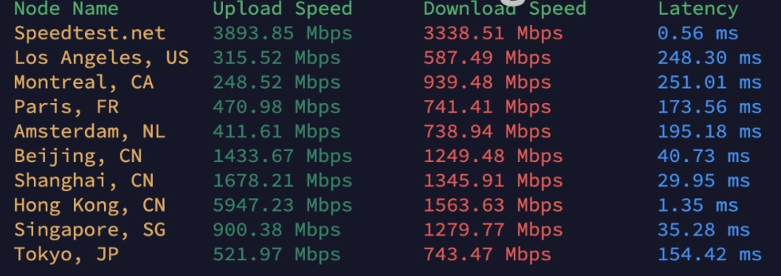
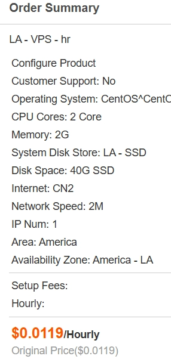

# 搬瓦工VPS测评：CN2线路优化让中国大陆访问速度飞起

---

选VPS主机，大多数人看的是配置参数——CPU几核、内存多大、硬盘够不够。但老实说，对于普通网站来说，2核2G的配置就已经绰绰有余，再往上堆配置，网站速度也不会有什么明显变化。

真正影响访问速度的，其实是**线路**。

一条对中国大陆优化过的线路，能让你的海外VPS访问速度提升一大截。搬瓦工（BandwagonHost）就是专门针对中国用户做了线路优化的主机商之一，平均延迟能压到47ms，这个表现基本和国内服务器差不多了。

---

## 搬瓦工的核心优势：CN2线路是什么

搬瓦工最被人称道的就是它的**CN2线路**。

简单说，CN2是中国电信开发的骨干网络，比普通国际线路更快、更稳定。搬瓦工的VPS直接对接了这条线路，所以中国大陆用户访问起来延迟特别低。

具体来说，搬瓦工有两种CN2线路：

**CN2 GT：** 速度比普通线路快一些，价格便宜，适合个人WordPress网站或者小型业务。

**CN2 GIA：** 顶配线路，专门针对中国大陆优化，速度更快、延迟更低、稳定性更高，适合对速度要求比较严格的用户。

除了线路，搬瓦工的机房位置也多——美国、香港、日本、新加坡都有。离中国大陆越近，访问速度自然越快。所以如果你想要极致的速度体验，可以选香港或者日本机房。

判断一家海外VPS对中国用户重不重视，就看两点：有没有CN2或其他中国优化线路，机房位置离中国大陆近不近。搬瓦工这两点都做到了。

---

## 价格：入门级VPS一年50美元

搬瓦工除了线路好，价格也便宜。

入门级VPS（1核1G）一年只要50美元，平均一天不到一块钱。这个价格包含了免费备份服务，还能免费切换机房，对于想长期运营网站的人来说，性价比非常高。

如果你觉得1核1G不够用，可以看看它的中配VPS：半年50美元，配置变成2核3G，线路也是中国优化的CN2。这款VPS适合流量稍微大一点的网站，比如小型跨境电商站、外贸站之类的。

👉 [搬瓦工的CN2线路配置选择很灵活，想提升网站访问速度可以看看这里](https://bandwagonhost.com/aff.php?aff=79616)

这两款VPS已经能满足大部分普通人的业务需求了。无论是搭建个人博客、WordPress网站，还是做国外广告联盟的英文独立站，甚至小型电商网站，都没问题。

---

## 适合谁用搬瓦工

搬瓦工的入门级VPS其实挺适合以下几类人：

**个人站长：** 想搭个博客网站玩玩，或者学习一下服务器知识。

**跨境电商从业者：** 需要一个稳定的海外VPS来跑外贸站或者电商站。

**学生党：** 预算有限，想自己折腾VPS学习技术。

**广告联盟EMU玩家：** 搭建英文独立站，做流量测试。

总之，如果你的业务规模不大，但对访问速度有要求，搬瓦工是个不错的选择。

---

## 搬瓦工实测：香港CN2 GIA线路表现如何

我自己买了一台搬瓦工的香港CN2 GIA线路VPS（1核1G），测试了一下实际表现。

### 配置和性能

这台VPS隐藏了CPU的真实型号（为了安全考虑），但能看到主频是2.7GHz，属于中等偏低水平，处理日常任务没问题。缓存16MB，在1核1G的配置中已经算很高了。磁盘容量21G，稍微小了点，但对于小型网站来说够用。

服务器运行很稳定，我用了2个月没出现过中断。唯一的缺点是不支持IPV6，如果有这个需求得单独提交工单，比较麻烦。

### 访问速度测试

全国平均延迟**47ms**，这个表现已经非常优秀了。香港VPS搭配CN2线路，访问速度基本和国内服务器差不多。

### 上传下载速度

亚洲地区的上传和下载速度非常稳定，表现很好。但欧美地区稍微差一点，这也正常，毕竟搬瓦工主要针对的就是中国大陆用户。

---

## 搬瓦工 vs RAKsmart：谁更值得买

RAKsmart也是一家支持中国线路优化的VPS主机商，和搬瓦工经常被拿来对比。

我拿搬瓦工的"性价比之王"套餐（8.8美元/月，2核3G）和RAKsmart的同价位VPS（8.5美元/月）做了个对比：

搬瓦工的CPU核数比RAKsmart有优势（2核 vs 1核），但RAKsmart的线路选择更多一些。如果你更在意CPU性能，搬瓦工更合适；如果你想要更灵活的线路切换，RAKsmart可能更适合。

---

## 使用搬瓦工的常见问题

### 1. 搬瓦工能退款吗？

搬瓦工的退款政策比较严格，只有在购买后**5天内**才能申请全额退款，而且续费和升级的订单不接受退款。退款需要登录后台提交工单申请。

相比之下，Bluehost、FastComet这些主机商能支持1个月内退款，这点搬瓦工确实差一些。

### 2. 搬瓦工IP被封了怎么办？

如果IP被封，可以先试试在后台切换机房（免费的）。如果切换机房无效，就提交工单请求更换新IP，费用是3美元一次。

另外一个办法是使用CDN服务来隐藏VPS的真实IP，从根本上降低IP被封的可能性。

### 3. 支付方式有哪些？

搬瓦工支持支付宝、银联、信用卡、PayPal四种支付方式，国内用户用支付宝支付就行。

### 4. 优惠码怎么用？

购买时记得使用优惠码**BWHCGLUKKB**，最低6%折扣，最高11%，可以无限次使用。

---

## 总结

搬瓦工的VPS适合大部分普通人的业务需求——个人博客、小型电商站、外贸站、广告联盟独立站都能跑。它的核心优势就是**CN2线路优化**和**高性价比**，中国大陆用户访问速度快，价格也不贵。

如果你正在找一个稳定、速度快、价格合理的海外VPS，👉 [搬瓦工绝对值得一试，尤其是它的CN2线路套餐](https://bandwagonhost.com/aff.php?aff=79616)。
